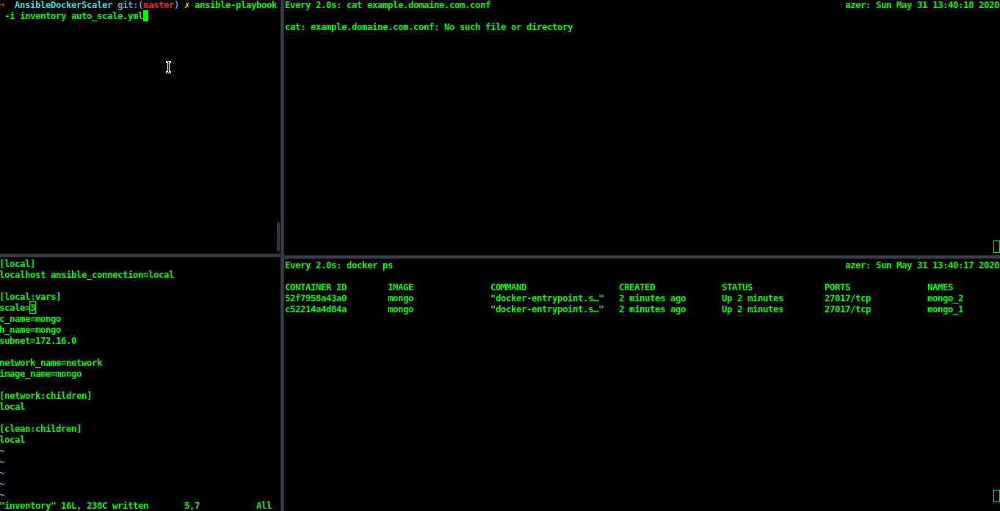

# AnsibleDockerScaler
Scale your containers  with ansible on a non kubernetes/swarm environment, 

## setup 

Requirements:
* ansible 2.9 
* docker latest 
* docker python package installed on the remote host 

clone the repo 
`git clone https://github.com/hatembentayeb/AnsibleDockerScaler`

Specify the scaler number on `inventory` file 
Specify the image name 
Run the playbook: `ansible-playbook -i inventory auto_scale.yml`

## Use case

This playbook is used on CI/CD pipelines for microservices on a non kubernetes/swarm environment .. like dedicated servers ..etc

## Contribution 

Hope it helps som1, don t hesitate to contribute i would be extremely grateful.